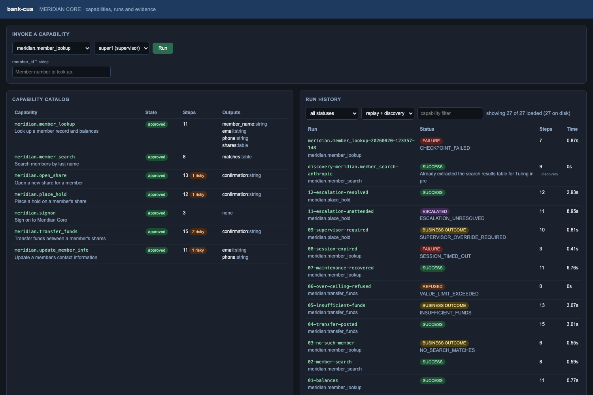

# bank-cua — record-once / replay-many computer use for legacy back-office apps

An LLM figures out how to accomplish a task in a legacy UI **once** (discovery),
the run is compiled into a **typed, versioned, reviewable capability artifact**,
and that artifact is then **replayed deterministically with no model in the
loop** — the path an AI agent triggers in production. Replay handles real runtime
conditions (validation errors, not-found, permission denials, interstitials,
timeouts), enforces safety guardrails, and escalates to a human who can take
control of the *same live session* when it can't safely proceed.

> The model discovers → the artifact becomes a reusable capability →
> deterministic replay is how the agent invokes it in production.

The system runs against two targets:

| Target | What it is | Docs |
|---|---|---|
| **MERIDIAN CORE** | The hosted legacy console at `web-sample.interface-hiring.com`. Seven recorded capabilities, exposed as an API, driven by a chatbot, watchable on a dashboard. | [ADAPTATION.md](ADAPTATION.md) |
| **Corebank** (`mockbank/`) | The local mock the core was originally built against, including a second rebranded tenant. | [REPORT.md](REPORT.md) |

**Every design decision, with the alternatives that lost and what would make each
one wrong, is in [docs/DECISIONS.md](docs/DECISIONS.md).**

---

## Quick start — MERIDIAN CORE demo

```bash
python3 -m venv .venv && source .venv/bin/activate
pip install -r requirements.txt
python -m playwright install chromium
```

**1. Configure operator credentials.** The API never accepts a password over the
wire; it resolves an operator *alias* from a store you configure.

```bash
cp config/credentials.example.json config/credentials.json
```

(The example file already carries the assignment's public demo operators. The
real file is gitignored.)

**2. Record the seven capabilities** against the live target. A real model drives
a real browser through the real discovery loop, and the successful run is
compiled into a typed artifact:

```bash
export ANTHROPIC_API_KEY=sk-...
python scripts/record_meridian.py --provider anthropic --model claude-sonnet-5
```

The committed capabilities were recorded exactly this way — every one carries
`provenance.recorded_by: anthropic`. Without a key, `--provider scripted`
(the default) replays recorded decision traces through the same loop, same
browser, same compiler; only *who chooses the action* differs.

**3. Review and approve them.** Capabilities ship as `draft` — approval is a
human act performed against a deployment, and the API refuses to invoke a draft.
This script walks the review gate for real, ratifying each irreversible step with
a recorded justification:

```bash
python scripts/approve_meridian.py
```

**4. Start the three surfaces**, each in its own terminal:

```bash
python -m bankcua.cli serve          # capability API   -> http://127.0.0.1:8080
```
```bash
python -m bankcua.cli chat --router llm   # chatbot     -> http://127.0.0.1:8081
```

(`--router llm` routes with a live model over the published manifest and needs
the key; the default `--router rule` is deterministic and needs nothing.)
```bash
python -m bankcua.cli dashboard      # run dashboard    -> http://127.0.0.1:8082
```

Those three come up open, with the operator chosen from a dropdown — the
single-operator demo path. To run them **behind a sign-in**, with what each
person may do decided by who they are, start the console instead:

```bash
python -m bankcua.cli portal init                    # writes the sign-in files
```
```bash
python -m bankcua.cli serve --require-session        # API, sessions enforced
```
```bash
python -m bankcua.cli portal                         # console -> http://127.0.0.1:8083
```

See [Signing in](#signing-in--one-console-two-tabs-one-identity) below.

**5. Drive it from the dashboard** — pick a capability, fill its typed inputs,
choose an operator, and press Run. The dashboard calls the same public API any
agent would, holds no credentials, and gets no special treatment; every run
appears below with its status, outputs, redacted event log and screenshots.



Note what the invoke form asks for: `member_id` and nothing else. The manifest
deliberately omits credentials and the identity the service supplies, so a
caller is never invited to send a password.

**Or drive it from the chatbot**, which is a thin front door over the same API:

| Ask | What you should see |
|---|---|
| `what are the balances for member 100234?` | `success` with a typed share grid — note one share is on `HOLD` |
| `find members named Turing` | `success` with candidate rows; it selects nobody |
| `balances for member 999999` | `business_outcome` — an answer, not an error |
| `transfer 1.00 from 100234-S0070 to 100234-S0001-3` | `success` with the host's confirmation number |
| `transfer 9000 from 100234-S0070 to 100234-S0001-3` | `refused` — over the ceiling, nothing opened |
| `transfer 2000 from 100234-S0070 to 100234-S0001-3` | pauses over the dual-control threshold rather than failing closed. **A second supervisor counter-signs it** — in the console, the *Paused* panel offers `Counter-sign`, and the run resumes on the spot. Unattended it is `escalated`; shorten the wait with `serve --handoff-timeout 15`, or clear the gate non-interactively by passing an independent `approver` to `POST /invoke` |
| `place a fraud hold on 100234-S0070` (as **teller1**) | `refused` before a browser opens — the service refuses on identity, so nothing is driven |
| the same, as **super1** | `escalated` — paused on a live session for a person, with a CDP endpoint to attach to |

Rows that escalate hold the session open for `--handoff-timeout` seconds (90 by
default) waiting for an operator. That default suits a person who has to be
fetched; pass a smaller value when demonstrating.

Watch each run land on the dashboard with its status, typed outputs, redacted
event log, and screenshots.

**6. Take control of the escalated run.** While the `super1` hold is paused:

```bash
python -m bankcua.cli operator list
python -m bankcua.cli operator console --id replay-meridian.place_hold-step9
```

The console serves the live page as a picture; click it, and every action is
recorded into the intervention before control returns to the automation.

### Signing in — one console, two tabs, one identity

`python -m bankcua.cli portal` serves a sign-in page with the dashboard and the
assistant mounted behind it, on one origin so a single session covers both. What
a person can see and do is decided by **who signed in**.

| Sign-in | Password | Is |
|---|---|---|
| `super1` | `password` | Supervisor — the Meridian operator of the same name |
| `teller1` | `password` | Teller — likewise |
| `100234`, `100987`, `101555`, `102777`, `103001` | `member123` | Members, one per member number |

Staff sign in with the operator credentials the target itself uses
(`https://web-sample.interface-hiring.com/signon`). The five member sign-ins are
new: a member is *not* a Meridian operator, so their work runs **delegated** as
the deployment's least-privileged staff alias (`default_operator`, a teller) and
is bound to their own member number on every call.

What each sign-in reaches is declared per capability in `config/service.yaml`:

| Capability | supervisor | teller | member |
|---|:--:|:--:|:--:|
| `meridian.member_lookup` | ✓ | ✓ | ✓ own record only |
| `meridian.transfer_funds` | ✓ | ✓ | ✓ between their own shares |
| `meridian.update_member_info` | ✓ | ✓ | ✓ own record only |
| `meridian.member_search` | ✓ | ✓ | — |
| `meridian.open_share` | ✓ | ✓ | — |
| `meridian.signon` | ✓ | ✓ | — |
| `meridian.place_hold` | ✓ | — | — |

Capabilities with no `allowed_principal_roles` line default to **staff only**, so
a new capability cannot become member-reachable by omission.

Try it:

| Signed in as | Ask | What you should see |
|---|---|---|
| `100234` | `what are my balances?` | runs — no member number was typed; it came from the sign-in |
| `100234` | `balances for member 100987` | `refused` · `MEMBER_SCOPE_VIOLATION` — refused, not silently retargeted |
| `100234` | `transfer 50 from 100234-S0070 to 100987-S0001` | `refused` · `MEMBER_SCOPE_VIOLATION` — the share names another member |
| `100234` | `place a fraud hold on 100234-S0070` | not in their action space at all; refused again at the API if asked directly |
| `teller1` | `place a fraud hold on 100234-S0070` | `refused` · `CAPABILITY_NOT_PERMITTED_FOR_ROLE`, before a browser opens |
| `super1` | the same | `escalated` — paused on a live session for a person |

**Where this is enforced.** Not in the page. The console mints a signed session
token; the capability API re-resolves it against the principal store on every
call and applies the role and member-scope rules itself
(`bankcua/auth.py`, `bankcua/service.py`). Deleting the console would cost the
system its sign-in page and none of its authorisation. Three properties follow,
each asserted in `tests/test_auth.py`, `tests/test_session_authz.py` and
`tests/test_portal.py`:

* **the token carries an identity, never a permission** — a username and an
  expiry, nothing else, so role and scope are read live and a demotion takes
  effect on the next request rather than at the next sign-in;
* **a signed-in caller cannot choose its operator** — the alias comes from the
  sign-in, so a teller's session naming `super1` is refused
  (`OPERATOR_NOT_SESSION`);
* **the projection is filtered before it is serialised** — a member's run list,
  run detail and evidence are scoped server-side, and a run id they do not own
  is a 404 rather than a hidden row.

**Two kinds of pause, two different answers.** A gated *irreversible step*
pauses on a live session and needs someone to **drive** it — that is the
*Take control* flow. A *dual-control* threshold pauses **before the browser has
been sent anywhere** and needs a second person to **approve**; the panel offers
`Counter-sign` instead, and the identity comes from the sign-in rather than from
a request field. The run's initiator cannot counter-sign their own run, and the
engine re-checks that independently of whatever the console posts — so start the
$2,000 transfer as `teller1` and approve it as `super1`.

**One thing the sign-in does not cover.** The co-browsing operator console
(`bankcua/escalation/console.py`, port 8090) is started by the dashboard but
serves on its own port and carries no session of its own — anyone who can reach
that port on the host can drive a paused session. The *button* is now
supervisor-only, which is the change this console makes; putting the console
itself behind the same session is the obvious next step and is not done here.

Two request fields are refused outright from a member sign-in: `approver`
(which clears the dual-control gate — and a member's work is *initiated* by the
delegated teller alias, so naming a supervisor would look independent) and
`tenant` (which re-points a capability at another deployment). Both were always
caller-supplied, which was defensible while every caller was the institution.

Managing sign-ins:

```bash
python -m bankcua.cli portal init                       # session key + principals file
python -m bankcua.cli portal hash --password 'new one'  # paste into config/principals.json
```

`config/principals.json` is gitignored and holds **no Meridian credential** — a
sign-in names an operator alias, and the alias's secret still comes from
`config/credentials.json` at invocation time.

### Regenerate the evidence

```bash
python scripts/gen_meridian_evidence.py   # 14 scenarios, live
```

See [evidence/meridian/README.md](evidence/meridian/README.md) for what each one
demonstrates.

### A note on the shared target

`web-sample.interface-hiring.com` has a **global** fault-injection setting any
visitor can change, and it was repeatedly found at 100% failure during
development. If runs fail inexplicably, check and reset it:

```bash
python scripts/meridian_control.py show
python scripts/meridian_control.py reset
```

The agent itself is blocked from that screen by `config/policy.meridian.yaml` —
an automation that can switch off its own error conditions can hide its own
failures. The harness may set up the world; the automation may not.

---

## What's here

| Area | Where |
|---|---|
| Typed capability artifact schema | `bankcua/schema.py` |
| Surface abstraction (perceive/act seam) | `bankcua/surface/base.py` |
| Playwright web surface (frames, locator synthesis, CDP) | `bankcua/surface/web_playwright.py` |
| Goal-driven discovery loop + LLM providers | `bankcua/agent/` |
| Transcript → artifact compiler | `bankcua/agent/compiler.py` |
| Deterministic replay engine + error taxonomy | `bankcua/replay/` |
| Locator robustness (label-proximity) + drift telemetry | `surface/web_playwright.py`, `replay/result.py` |
| Bounded, policy-checked assisted recovery | `bankcua/replay/engine.py` |
| Safety: allowlist, layered risk model, value limits + velocity ledger, redaction | `bankcua/safety/` |
| Second surface: accessibility tree + coordinates (no DOM) | `bankcua/surface/accessibility.py` |
| Static portability: will this artifact run on that surface? | `bankcua/portability.py` |
| Drift-driven repair proposals (detect → propose → approve → apply) | `bankcua/repair.py` |
| Co-browsing operator console over CDP | `bankcua/escalation/console.py` |
| Escalation & live-session handoff (CDP) | `bankcua/escalation/handoff.py` |
| Vendor-shared known-condition library | `bankcua/knowledge.py` |
| Cross-tenant reuse: overrides + canonicalization | `bankcua/tenancy.py` |
| Capability catalog + agent-facing HTTP API | `bankcua/catalog.py`, `bankcua/service.py` |
| Server-side authorisation (risk, approval, roles) | `config/service.yaml` |
| Operator credential resolution (alias -> secret) | `bankcua/safety/credentials.py` |
| Vendor error taxonomies, as data | `config/knowledge/*.yaml`, `bankcua/knowledge.py` |
| Chatbot: routing seam + result presentation | `bankcua/chat/` |
| Run dashboard (read-only projection of evidence) | `bankcua/dashboard.py` |
| Sign-in: principals, sessions, role gate, member scoping | `bankcua/auth.py` |
| Signed-in console (login + dashboard/assistant tabs) | `bankcua/portal/app.py` |
| Who may sign in (hashed, gitignored) | `config/principals.json` |
| MERIDIAN capabilities + recording | `capabilities/meridian/`, `scripts/record_meridian.py` |
| Target fault-state control (harness only) | `scripts/meridian_control.py` |
| Code generation (artifact → Playwright script) | `bankcua/codegen.py` |
| CLI | `bankcua/cli.py` |
| Mock legacy bank app (proxy target) | `mockbank/app.py` |
| Saved artifacts | `capabilities/` |
| Discovery + replay + handoff evidence | `evidence/` |

## The local mock target (round 1)

`mockbank/` is a deliberately **legacy-style** web app: server-rendered,
table-based markup, **no test IDs**, the savings balance rendered inside an
**iframe**, and cookie sessions that expire. It exposes deterministic,
injectable exception states so replay error-handling is testable without
flakiness — see the docstring in `mockbank/app.py`.
Login (fake, demo only): `operator` / `password123`.

---

## Setup — Corebank / local mock

```bash
python3 -m venv .venv && source .venv/bin/activate     # optional
pip install -r requirements.txt
# Chromium for Playwright (skip if PLAYWRIGHT_BROWSERS_PATH already provides it):
python -m playwright install chromium
```

`ANTHROPIC_API_KEY` is only needed to run a **fresh live discovery** with the
real API provider. Replay and the offline discovery reproduction need no key.

---

## Verify the Corebank path (one command)

On a machine with internet (e.g. your Mac Terminal):

```bash
cd bank-cua
bash scripts/verify.sh
```

This creates an isolated venv, installs dependencies + Chromium, then runs the
full test suite, an offline discovery→artifact run (no key, into a scratch dir so
your committed artifacts are untouched), all replay/error/cross-tenant/handoff/
stability scenarios, the agent API + codegen, and safety sweeps — printing a
clear per-step PASS/FAIL and a final `VERIFICATION PASSED`. Takes a few minutes
(mostly dependency install).

---

## Corebank demo path (the local mock, round 1)

Start the mock app in one terminal:

```bash
python mockbank/app.py            # serves http://127.0.0.1:5057
```

### 1. Discovery → capability artifact

Reproduce discovery offline from the recorded model decisions (no key):

```bash
bash scripts/run_discovery.sh
# -> capabilities/corebank.member_savings_lookup.json
# -> capabilities/corebank.open_subaccount.json
# -> evidence/discovery-*/  (screenshots, transcript.json, run.jsonl, summary.json)
```

Or run a **genuinely live** discovery with your own key:

```bash
export ANTHROPIC_API_KEY=sk-...
python -m bankcua.cli discover \
  --task config/tasks/member_savings_lookup.json --provider anthropic
```

Inspect the capability catalog:

```bash
python -m bankcua.cli catalog list
python -m bankcua.cli catalog manifest        # agent-callable function schema
python -m bankcua.cli catalog show --id corebank.member_savings_lookup
```

### 2. Deterministic replay (no LLM) — the production path

```bash
# happy path -> success + typed outputs
python -m bankcua.cli replay \
  --artifact capabilities/corebank.member_savings_lookup.json \
  --param username=operator --param password=password123 --param member_id=12345

# business outcome (NOT a crash): no such member
python -m bankcua.cli replay \
  --artifact capabilities/corebank.member_savings_lookup.json \
  --param username=operator --param password=password123 --param member_id=00000
```

Result is a structured contract distinguishing `success` (+outputs),
`business_outcome` (e.g. `MEMBER_NOT_FOUND`), and `failure`
(with step, expected, observed, and evidence).

A business outcome can also carry data. Member `99999` exists but is locked:
Corebank's denial screen withholds the balance yet still names the member, so
replay returns `PERMISSION_DENIED` **with** `member_name` populated and
`outputs_surfaced: ["member_name"]`:

```bash
python -m bankcua.cli replay \
  --artifact capabilities/corebank.member_savings_lookup.json \
  --param username=operator --param password=password123 --param member_id=99999
```

### 3. Inject runtime conditions

```bash
# recoverable: an unexpected maintenance interstitial is auto-dismissed
curl "http://127.0.0.1:5057/_control/set?key=inject&value=interstitial"
python -m bankcua.cli replay --artifact capabilities/corebank.member_savings_lookup.json \
  --param username=operator --param password=password123 --param member_id=12345
curl "http://127.0.0.1:5057/_control/reset"

# hard failure: session timeout is detected and surfaced (not blindly retried)
curl "http://127.0.0.1:5057/_control/set?key=timeout&value=on"
python -m bankcua.cli replay --artifact capabilities/corebank.member_savings_lookup.json \
  --param username=operator --param password=password123 --param member_id=12345
curl "http://127.0.0.1:5057/_control/reset"

# a fill the page silently discards: the keystrokes succeed and the page looks
# normal, so only reading the control back catches it -> FILL_NOT_APPLIED
curl "http://127.0.0.1:5057/_control/set?key=inject&value=swallow"
python -m bankcua.cli replay --artifact capabilities/corebank.member_savings_lookup.json \
  --param username=operator --param password=password123 --param member_id=12345
curl "http://127.0.0.1:5057/_control/reset"
```

### 3b. Value-level policy: amount limits and dual control

The URL/action allowlist cannot tell $1 from $1M. `config/policy.yaml` adds
per-parameter `value_rules`, checked before the browser opens.

```bash
# over the hard ceiling -> refused outright, nothing is opened
python -m bankcua.cli replay --artifact capabilities/corebank.open_subaccount.json \
  --allow-risky --param username=operator --param password=password123 \
  --param member_id=12345 --param acct_type="Money Market" --param deposit=25000.00

# over the dual-control threshold with nobody counter-signing -> fails closed
python -m bankcua.cli replay --artifact capabilities/corebank.open_subaccount.json \
  --allow-risky --param username=operator --param password=password123 \
  --param member_id=12345 --param acct_type="Money Market" --param deposit=1500.00

# an independent second approver clears the value gate (a run cannot approve itself)
python -m bankcua.cli replay --artifact capabilities/corebank.open_subaccount.json \
  --allow-risky --initiator alice --approver bruce \
  --param username=operator --param password=password123 \
  --param member_id=12345 --param acct_type="Money Market" --param deposit=1500.00
```

### 4. Escalation & human handoff on the same live session

Replaying the sub-account capability hits an **irreversible** "Confirm and
Create" step. Without risk approval, replay pauses and raises an intervention;
a human operator takes control of the **same live browser over CDP**, performs
the step, and hands control back — then replay resumes.

Terminal A (replay pauses at the gated step, exposes the session on CDP):

```bash
python -m bankcua.cli replay \
  --artifact capabilities/corebank.open_subaccount.json --cdp-port 9222 \
  --param username=operator --param password=password123 \
  --param member_id=12345 --param acct_type="Money Market" --param deposit=500.00
```

Terminal B (operator console stand-in — list, then take control & resolve):

```bash
python -m bankcua.cli operator list
python -m bankcua.cli operator resolve --id replay-corebank.open_subaccount-step9 \
  --do "click_selector:input[type=submit]" --manual
```

A self-contained, scripted version of this handoff is in
`scripts/gen_evidence.py` (scenario 06) if you don't want two terminals.

### 4b. A second surface: replay with no DOM at all

The same artifact, driven through a surface that perceives only an accessibility
tree and acts only with a mouse and keyboard — the model a desktop UIA/AX driver
works in. Nothing about the artifact changes.

```bash
python -m bankcua.cli replay --artifact capabilities/corebank.member_savings_lookup.json \
  --surface a11y \
  --param username=operator --param password=password123 --param member_id=12345

# and whether an artifact CAN run on a surface is decidable before launching:
python -m bankcua.cli catalog portability --id corebank.member_savings_lookup
```

### 4c. Operator console (real co-browsing)

Replaying the sub-account capability pauses at the irreversible step. Instead of
resolving it from the CLI, open the console and drive the live session yourself:

```bash
python -m bankcua.cli operator list
python -m bankcua.cli operator console --id replay-corebank.open_subaccount-step9
#   -> http://127.0.0.1:8090  : the live page as a picture; click it, type,
#      then "Resume automation". Every action is recorded into the intervention.
```

### 4d. Drift-driven repair

Every replay contributes drift to a ledger. Once a step drifts repeatedly, a
reviewable proposal is emitted — never applied silently:

```bash
python -m bankcua.cli repair analyse --id corebank.member_savings_lookup
python -m bankcua.cli repair list
python -m bankcua.cli repair apply --id <proposal-id>   # -> new version, draft
python -m bankcua.cli catalog approve --id corebank.member_savings_lookup
```

### 5. Cross-tenant reuse (one artifact, another institution)

The same capability, recorded on tenant `demo-cu`, runs against tenant
`summit-cu` — the same vendor product with rebranded labels ("Member Number" vs.
"Member ID", "Find" vs. "Search") — via a ~4-line string override. Start the
Summit variant, then:

```bash
MOCKBANK_PORT=5059 MOCKBANK_VARIANT=summit python mockbank/app.py   # other terminal

# clean run on Summit using the tenant override
python -m bankcua.cli replay --artifact capabilities/corebank.member_savings_lookup.json \
  --tenant config/tenants/summit-cu.json \
  --param username=operator --param password=password123 --param member_id=12345
```

With no override, the same artifact still succeeds on Summit via structural
locator fallbacks and reports `drifts` — graceful degradation, not a cliff.

### 6. Confidence: stability signal + approval gate

```bash
# replay N times -> pass rate; optionally write it into the artifact
python -m bankcua.cli replay --artifact capabilities/corebank.member_savings_lookup.json \
  --repeat 5 --update-stability \
  --param username=operator --param password=password123 --param member_id=12345

# unattended replay is refused until a human approves the capability
python -m bankcua.cli replay --artifact capabilities/corebank.member_savings_lookup.json \
  --require-approved --param username=operator --param password=password123 --param member_id=12345
python -m bankcua.cli catalog approve --id corebank.member_savings_lookup
```

Approval also requires that a human has reviewed every step the risk classifier
marked irreversible — the heuristic proposes, a person ratifies (and may
downgrade a false positive, with the justification recorded on the step):

```bash
python -m bankcua.cli catalog approve --id corebank.open_subaccount     # REFUSED
python -m bankcua.cli catalog review  --id corebank.open_subaccount --step 9 \
  --risk risky --note "creates a real sub-account; irreversible"
python -m bankcua.cli catalog approve --id corebank.open_subaccount     # ok
```

### 7. Agent-facing API + code generation

```bash
# expose capabilities as callable-by-name HTTP endpoints. `serve` publishes the
# MERIDIAN catalog by default, so name this one explicitly to reach corebank.
python -m bankcua.cli serve --dir capabilities   # http://127.0.0.1:8080
#   GET  /capabilities            -> function-calling manifest
#   POST /invoke/<id>             -> runs replay, returns the result contract

# emit a runnable standalone Playwright script from an artifact
python -m bankcua.cli codegen --artifact capabilities/corebank.member_savings_lookup.json \
  --out generated/lookup.py
```

Assisted recovery (opt-in, bounded): add `--assist` to a replay to allow one
policy-checked LLM decision to recover a single failed step (never open-ended).

### 8. Regenerate all evidence at once

```bash
python scripts/gen_evidence.py     # starts both tenants; runs scenarios 01–15
```

---

## Tests

```bash
python -m pytest -q
```

Unit tests (schema, policy, redaction, compiler, transforms) run without a
browser; integration tests start the mock app and exercise the replay result
contract end-to-end (they skip if Playwright/the app can't start).

---

## Notes / what is mocked

- **The committed discovery evidence is a genuine live run** against the mock via
  the Anthropic Messages API (`AnthropicProvider`) —
  see `evidence/discovery-*-anthropic-live/` (`recorded_by: anthropic`, per-step
  screenshots + transcript). A **key-free offline reproduction** of an equivalent
  run is also provided via the `bridge` provider (`scripts/run_discovery.sh`),
  which drives the same real loop from a recorded decision trace.
- **Operator console** is a CLI stand-in; the **handoff mechanism is real**
  (CDP attach to the live session, recorded human actions, control token,
  resume). See REPORT §5.
- **Cross-tenant reuse is demonstrated** end-to-end against a second rebranded
  tenant variant (`MOCKBANK_VARIANT=summit`). The **desktop/legacy-web surfaces**
  remain designed, not built — see REPORT §4. The `Surface` seam keeps them out
  of the core's way.
